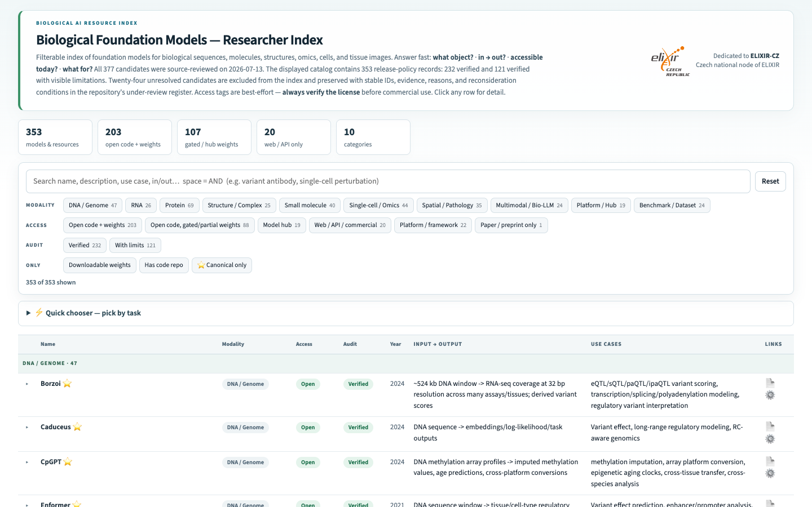

# Biological Foundation Models

A researcher-oriented index of foundation models for biological sequences, molecules, structures, omics, cells, and tissue images. Explore what each model operates on, its inputs and outputs, current access route, and representative research uses.

**[Open the interactive index](https://michalie.github.io/bio-foundation-models-wiki/)**

## What the index provides

- Search and filters across biological modalities, access routes, audit status, and publication year.
- Concise input/output and use-case descriptions for researcher triage.
- Direct links to papers, code, model hubs, and official services.
- Stable record identifiers, provenance, evidence dates, and machine-readable distributions.

The displayed catalog is generated deterministically from [`models_final.json`](models_final.json). Records that need more evidence or fall outside the current inclusion policy are preserved separately in [`records_under_review.json`](records_under_review.json) and are not shown in the index.

## Machine-readable access

- [Catalog JSON](https://michalie.github.io/bio-foundation-models-wiki/models_final.json)
- [JSON Schema](https://michalie.github.io/bio-foundation-models-wiki/schema.json)
- [JSON-LD metadata](https://michalie.github.io/bio-foundation-models-wiki/metadata.jsonld)
- [Human-readable Markdown](https://michalie.github.io/bio-foundation-models-wiki/biological_foundation_models_wiki.md)
- [Review register](https://michalie.github.io/bio-foundation-models-wiki/records_under_review.json)

## Contribute

Suggest a model or correction through the [structured issue form](https://github.com/MichaLie/bio-foundation-models-wiki/issues/new?template=add-model.yml). Contributions should point to current primary or first-party sources; inclusion is reviewed against the documented scope and evidence policy.

## Maintain or fork

This repository includes its own reproducible maintenance system:

- [`MAINTENANCE.md`](MAINTENANCE.md) is the canonical update, validation, and release protocol.
- [`AGENTS.md`](AGENTS.md) and [`CLAUDE.md`](CLAUDE.md) map coding agents to that protocol.
- [`build.py`](build.py) creates synchronized public distributions.
- [`validate_catalog.py`](validate_catalog.py) enforces schema, provenance, licence, and release checks.
- [`.github/workflows/quality.yml`](.github/workflows/quality.yml) runs the deterministic quality gate on GitHub.

Forks should replace the resource identity, creator, publisher, licence, and provenance metadata with claims they are authorized to make.

## Stewardship and licences

Curated and published by **Michaela Liegertová** ([michaela.liegertova@img.cas.cz](mailto:michaela.liegertova@img.cas.cz)), affiliated with the [Institute of Molecular Genetics of the Czech Academy of Sciences](https://www.img.cas.cz/en/). Dedicated to the [ELIXIR-CZ](https://www.elixir-czech.cz/) community.

IMG affiliation and the ELIXIR-CZ dedication provide context; they do not imply institutional publication authority or endorsement.

Catalog data, metadata, and original documentation are licensed under [CC BY 4.0](LICENSE-CONTENT.md). Maintenance and build software are licensed under the [MIT License](LICENSE-CODE). Indexed papers, code, models, datasets, services, logos, and trademarks retain their own terms.

See [`CHANGELOG.md`](CHANGELOG.md) for version history.
